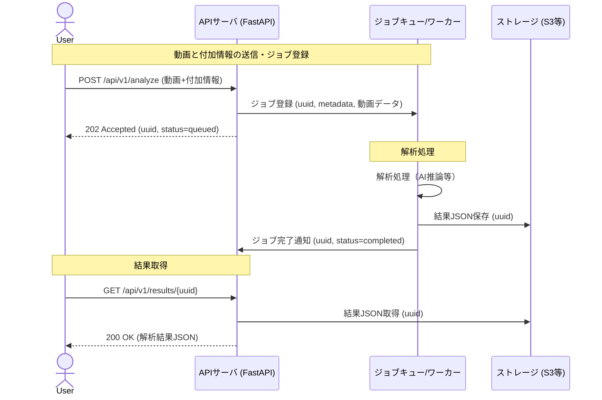

# 非同期APIシーケンス

以下は、動画解析APIの非同期フローを示すシーケンス図です（Mermaid表記）。

```mermaid
sequenceDiagram
    actor User
    participant API as APIサーバ (FastAPI)
    participant Worker as ジョブキュー/ワーカー
    participant Storage as ストレージ (S3等)

    Note over User,Worker: 動画と付加情報の送信・ジョブ登録
    User->>API: POST /api/v1/analyze (動画+付加情報)
    API->>Worker: ジョブ登録 (uuid, metadata, 動画データ)
    API-->>User: 202 Accepted (uuid, status=queued)

    Note over Worker: 解析処理
    Worker->>Worker: 解析処理（AI推論等）
    Worker->>Storage: 結果JSON保存 (uuid)
    Worker->>API: ジョブ完了通知 (uuid, status=completed)

    Note over User,API: 結果取得
    User->>API: GET /api/v1/results/{uuid}
    API->>Storage: 結果JSON取得 (uuid)
    API-->>User: 200 OK (解析結果JSON)
```

